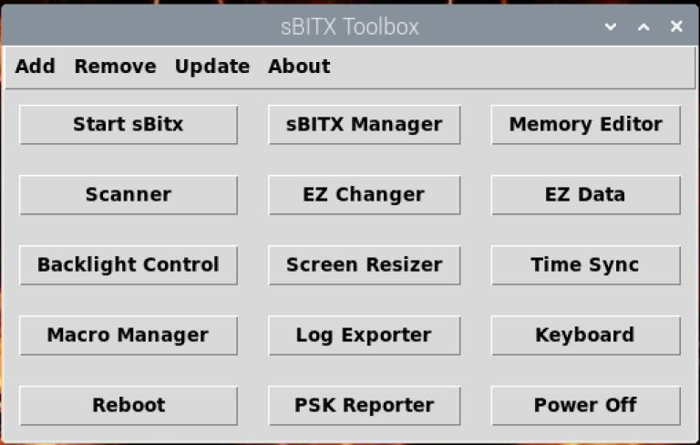

# sBITX-toolbox64

sBITX Toolbox is a collection of utilities and accessory applications for the sBitx transceiver created by W9JES. This version is specifically designed for the 64bit version of Raspberry Pi.





-----

What does sBITX Toolbox offer?

- sBITX Launcher: A convenient launcher style application that allows you to add, remove, or open apps with the click of a button.
- sBITX Manager: An application that can be used to store/recall frequency memories and provide auxiliary control of the transceiver.
- sBITX Scanner: An application that scans frequency ranges aiding in finding activity.
- sBITX Screen Resizer: A touchscreen application to change the default window size for better scrolling such as using WSJT-X and fldigi natively on the transceiver.
- sBITX Backlight Control: A touchscreen application to control the screen brightness for power conservation and eye comfort.
- sBITX EZ Data: Application to manage configuration backups.
- sBITX Macro Manager: An application to create, edit, and copy macros using predefined macros.
- sBITX Log Exporter: An application that allows logs to be selected and downloaded in ADIF.
- sBITX USB Headset Controller: An application that allows you to use USB audio devices like a headset, headphones, or microphone.
- sBITX Voice Keyer: An application that allows you to record, store, and transmit prerecorded voice messages commonly used in contests, DXing, POTA activations, and more.

**Please note that this version of sBITX-toolbox is currently compiled as a 64bit application. We offer a 32bit version [HERE](https://github.com/drexjj/sBITX-toolbox).**

-----

Installation
-----

Install on you 64bit sBITX:

Open terminal and type:

```console
cd $HOME
git clone https://github.com/drexjj/sBITX-toolbox64.git
cd sBITX-toolbox64
chmod +x *.sh
./installer.sh
```
Reboot the sBitx when finished and start using the toolbox.

Or see the instruction guide for installation steps.


Instruction Guide
-----

The detailed instruction guide is now in PDF format and is located at [Instruction Guide](https://github.com/drexjj/sBITX-toolbox64/blob/main/sBITX%20Toolbox%20Guide%20%20v2.3_64.pdf)

Release Notes are available at [Release Notes](https://github.com/drexjj/sBITX-toolbox64/blob/main/release_notes.txt)

-----

Become A Supporter
-----
If you find sBITX Toolbox valuable or have benefited from using it, consider supporting us. Every donation, big or small, helps us keep the lights on and the code flowing.

🌟 [Donate](https://www.paypal.com/donate/?hosted_button_id=SWPB76LVNUHEY) 🌟


Not in a position to donate? No worries! Contributing code, documentation, or simply spreading the word about sBITX Toolbox also goes a long way.

Thank you for your support and belief in my project!
