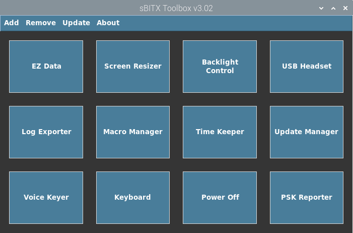

# sBITX-toolbox64

sBITX Toolbox is a collection of utilities and accessory applications for the sBitx transceiver created by W9JES. This version is specifically designed for the 64bit version of Raspberry Pi OS as provided at  https://github.com/drexjj/sbitx/releases.





-----

What does sBITX Toolbox offer?

- sBITX Launcher: A convenient launcher style application that allows you to add, remove, or open the following apps with the click of a button.
- TS1 Backlight Control: A touchscreen application to control the screen brightness on older sBitx screens for power conservation and eye comfort.
- TS2 Backlight Control: A touchscreen application to control the screen brightness on newer sBitx screens for power conservation and eye comfort.
- Band Conditions: An app that displays current band conditions including information such as solar data, MUF, and heat map.
- GPS Tool: This app provides a visual interface for using an external "puck style" GPS unit with your sBitx. Can update your grid and time with the press of a button.
- CW Detector: A zero-beat style indicator to aid in aligning your signal to the freqency of a CW signal.
- EZ Data: Application to simplify and manage configuration backups.
- V3PowerCal: An application to adjust your power settings per band.
- Macro Manager: An application to create, edit, and copy macros using predefined macros.
- Manager: An application that can be used to store/recall frequency memories and provide auxiliary control of the transceiver.
- Scanner: An application that scans frequency ranges aiding in finding activity.
- TS1 Screen Resizer: A touchscreen application designed for older sBitx screens to change the default window size for better scrolling such as using WSJT-X and fldigi natively on the transceiver.
- Screen Scaler: A handy tool for adjusting screen resolution, allowing apps with larger GUI windows to fit entirely on the built-in display.
- Time Keeper: A utility that syncs the real-time clock (RTC) module inside your sBitx transceiver to the system clock or accurate time source. Useful for off-network communications and data modes.
- Update Manager: A utility which makes it easy to update your sBitx software, Pi OS, and Github repository at the click of a button.
- Voice Keyer: An application that allows you to record, store, and transmit prerecorded voice messages commonly used for contests, DXing, POTA activations, etc., with the press of a button.


**Please note that this version of sBITX-toolbox is currently compiled as a 64bit application AND WILL NOT WORK ON THE OLDER sBitx hardware as shipped from the manufacturer. We recommend that you update your SD card to the latest software by our volunteer development team at  [Releases](https://github.com/drexjj/sbitx/release)

-----

Installation
-----

Install on you 64bit sBITX:

Open terminal and type:

```console
cd $HOME && git clone https://github.com/drexjj/sBITX-toolbox64.git && cd sBITX-toolbox64 && chmod +x *.sh && ./installer.sh
```
Reboot the sBitx when finished and start using the toolbox.

Or see the instruction guide for installation steps.

Upgrade
-----

If you encounter problems upgrading to a newer version, then please run this command from terminal.


```console
cd $HOME && cd sBITX-toolbox && git stash && git pull && chmod +x *.sh && ./upgrade.sh
```
Now run sBitx Toolbox and use the Update --> Check For Updates function again.


Instruction Guide
-----

The detailed instruction guide is now in PDF format and is located at [Instruction Guide](https://github.com/drexjj/sBITX-toolbox64/blob/main/sBITX%20Toolbox%20Guide%20%20v3.0.pdf)

Release Notes are available at [Release Notes](https://github.com/drexjj/sBITX-toolbox64/blob/main/release_notes.txt)

-----

Become A Supporter
-----
If you find sBITX Toolbox valuable or have benefited from using it, consider supporting us. Every donation, big or small, helps us keep the lights on and the code flowing.

🌟 [Donate](https://www.paypal.com/donate/?hosted_button_id=SWPB76LVNUHEY) 🌟


Not in a position to donate? No worries! Contributing code, documentation, or simply spreading the word about sBITX Toolbox also goes a long way.

Thank you for your support and belief in my project!
